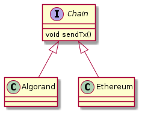

# Algorand and Polygon Bridge

Convert $ALGO to $MATIC or vice versa. 

## Specs

## Data flow
The database schema consists of from, to and amount information

## UI
The UI utitlizes the Flask Web framework to render bridge swap pages.

## Other
[contracts](doc/contracts.md)  
[lib](doc/lib.md)  
[scripts](doc/scripts.md)  

